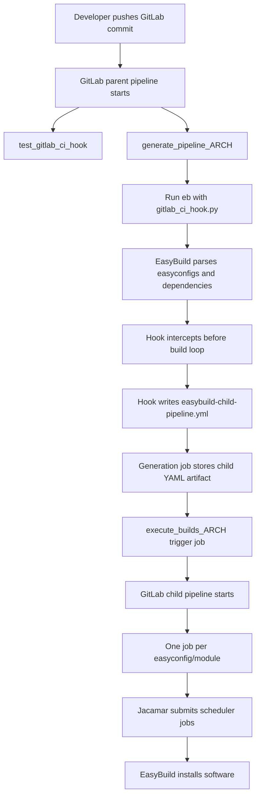
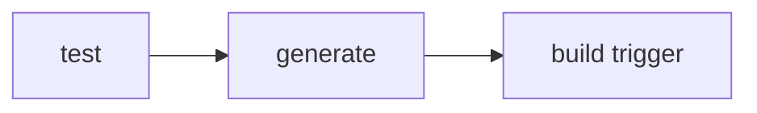
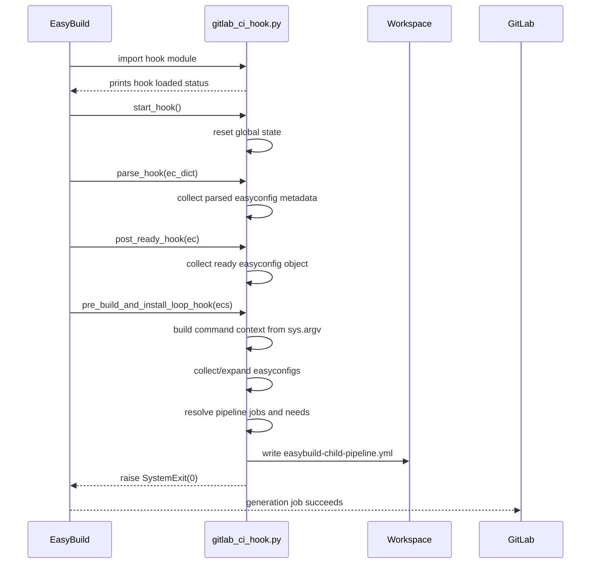
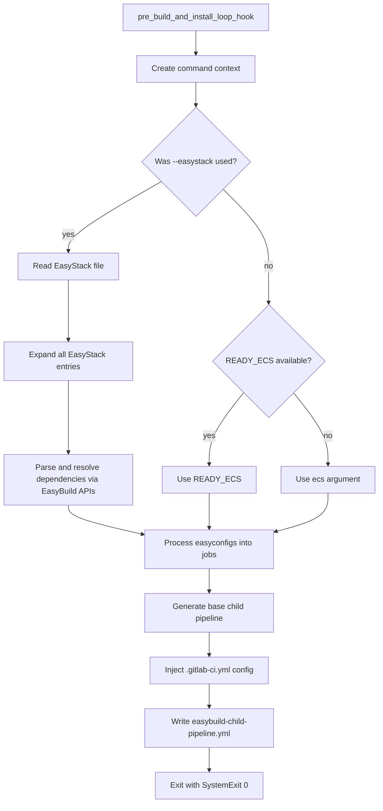
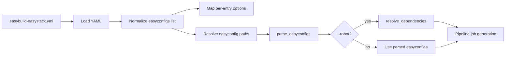
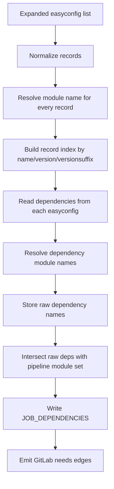
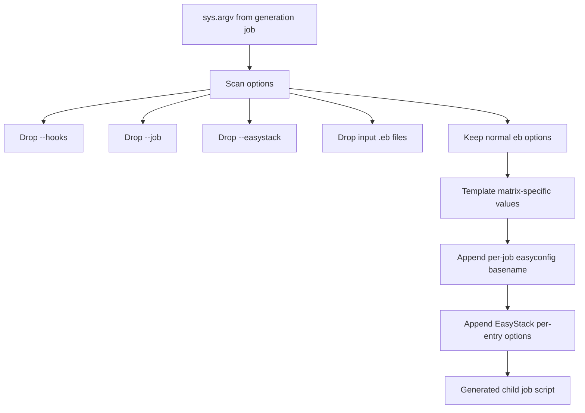
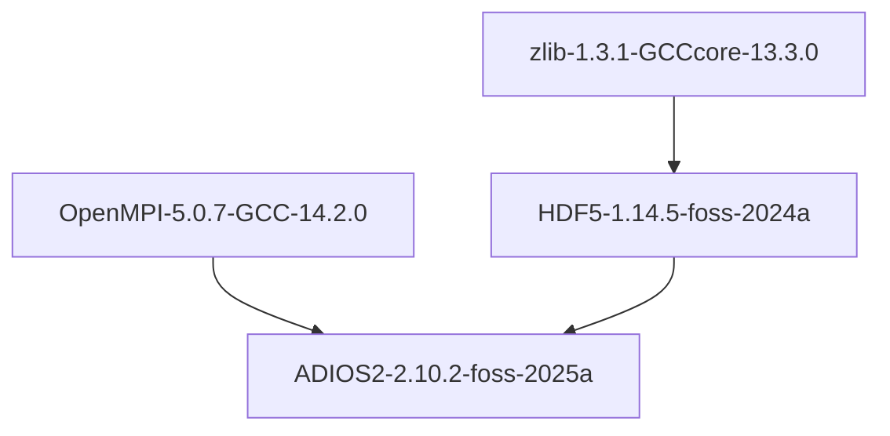
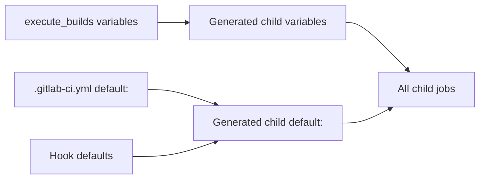
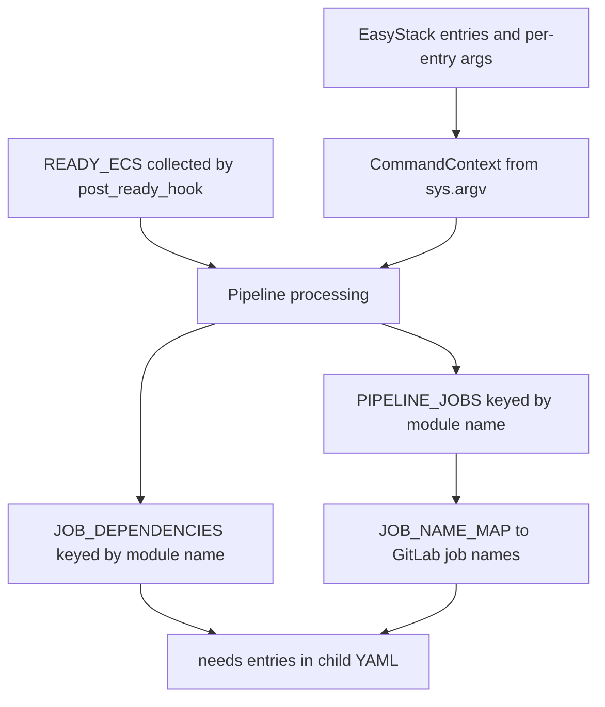

# EasyBuild GitLab CI Hook

This repository contains an EasyBuild hook that turns an EasyBuild run into a GitLab child pipeline. Instead of building software inside the pipeline-generation job, the hook lets EasyBuild parse the requested easyconfigs, resolves the dependency graph, writes `easybuild-child-pipeline.yml`, and exits before any build starts. The generated child pipeline then runs one GitLab job per EasyBuild module/easyconfig with `needs:` edges matching the EasyBuild dependency order.

The intended deployment target is an HPC GitLab Runner setup, typically using Jacamar CI to submit the generated jobs to a scheduler such as Slurm, PBS, or LSF.

## Contents

- [Prerequisites](#prerequisites)
- [High-Level Flow](#high-level-flow)
- [Main GitLab Pipeline](#main-gitlab-pipeline)
- [Hook Lifecycle](#hook-lifecycle)
- [EasyStack Flow](#easystack-flow)
- [Dependency Mapping](#dependency-mapping)
- [Command Reconstruction](#command-reconstruction)
- [Generated Child Pipeline](#generated-child-pipeline)
- [Configuration Inheritance](#configuration-inheritance)
- [Job Naming](#job-naming)
- [Runtime Data Model](#runtime-data-model)
- [Local Testing](#local-testing)
- [Troubleshooting](#troubleshooting)

## Prerequisites

This hook requires:

1. GitLab Runner installed and configured on the target HPC cluster.
2. Jacamar CI or another executor that can run GitLab jobs on the scheduler-backed compute environment.
3. An EasyBuild environment with the EasyBuild framework, easyblocks, easyconfigs, `PyYAML`, and site module tooling available.
4. A `.gitlab-ci.yml` that runs `eb --hooks=gitlab_ci_hook.py ...` in a generation job and triggers the produced child pipeline artifact in a build job.

Jacamar CI is not required by the Python hook itself. It matters because the generated jobs are actual build jobs and normally need scheduler allocation, module setup, shared installation paths, and shared source/build storage.

## High-Level Flow



The important design point is that EasyBuild still does the parsing and dependency work. The hook only changes the execution target: local EasyBuild build loop becomes GitLab child pipeline jobs.

## Main GitLab Pipeline

The parent pipeline in [.gitlab-ci.yml](.gitlab-ci.yml) has three logical stages:



### `test_gitlab_ci_hook`

Runs the Python unit tests for the hook. This catches command reconstruction, job naming, dependency mapping, EasyStack option conversion, and child-pipeline generation regressions before the generated build jobs are triggered.

### `generate_pipeline_<arch>`

Runs EasyBuild with the hook enabled. The current template passes architecture-specific variables such as:

- `ARCH`
- `PARTITION`
- `NTASKS_PER_NODE`
- `CUDA_COMPUTE_OPTION`
- `EB_PATH`
- `SOURCE_PATH`
- `TARGET_EASYSTACK`

The generation command has this shape:

```bash
eb --hooks=gitlab_ci_hook.py \
   --easystack=${TARGET_EASYSTACK} \
   --installpath=${EB_PATH}/${ARCH} \
   --installpath-modules=${EB_PATH}/${ARCH}/modules \
   --tmp-logdir=eblog --buildpath=ebbuild \
   --sourcepath=${SOURCE_PATH} \
   --robot --robot-paths=${CI_PROJECT_DIR}/custom_easyconfigs: \
   --module-naming-scheme=CategorizedHMNS \
   --insecure-download --disable-mpi-tests --skip-test-step --skip-test-cases \
   --accept-eula-for=Intel-oneAPI,CUDA,NVHPC,cuDNN \
   --trace --max-parallel=${NTASKS_PER_NODE} \
   ${CUDA_COMPUTE_OPTION}
```

The hook writes `easybuild-child-pipeline.yml`. The generation job renames it to `easybuild-child-pipeline-${ARCH}.yml` and stores it as a GitLab artifact.

### `execute_builds_<arch>`

Triggers the generated artifact as a child pipeline:

```yaml
trigger:
  strategy: depend
  forward:
    yaml_variables: true
    pipeline_variables: true
  include:
    - artifact: easybuild-child-pipeline-${ARCH}.yml
      job: generate_pipeline_${ARCH}
```

The `strategy: depend` setting makes the parent pipeline wait for the child pipeline result.

## Hook Lifecycle

EasyBuild loads hook functions by name. This hook implements several lifecycle hooks, but the critical one is `pre_build_and_install_loop_hook`.



### `start_hook`

Initializes global hook state:

- `PIPELINE_JOBS`
- `JOB_DEPENDENCIES`
- `GITLAB_CONFIG`
- `JOB_NAME_MAP`
- `PARSED_ECS`
- `READY_ECS`

It also snapshots GitLab CI environment values such as project URL, commit SHA, ref, registry image, and job token for logging/future use.

### `parse_hook`

Collects raw easyconfig dictionaries during parsing. This is useful diagnostic state, but it is not the main source for pipeline generation.

### `post_ready_hook`

Collects ready EasyBuild easyconfig objects after EasyBuild has resolved configuration details. For non-EasyStack invocation, this list is preferred over the raw `ecs` passed to the build-loop hook.

### `pre_build_and_install_loop_hook`

This is where the hook takes over. It runs immediately before EasyBuild would start building/installing software.



Raising `SystemExit(0)` is intentional. It prevents the generation job from doing the actual builds.

## EasyStack Flow

EasyBuild normally processes EasyStack files one entry at a time. That behavior is good for direct builds, but it is not enough for a pipeline generator because a child pipeline must include all EasyStack entries in one YAML file.

The hook handles that explicitly:

1. Detects `--easystack` in `sys.argv`.
2. Loads the EasyStack YAML.
3. Normalizes `easyconfigs:` entries into `(easyconfig_name, options)` tuples.
4. Converts each entry's `options:` mapping into EasyBuild CLI arguments.
5. Resolves all EasyStack easyconfig paths through EasyBuild's `det_easyconfig_paths`.
6. Parses all resolved easyconfigs through `parse_easyconfigs`.
7. If `--robot` was used, resolves dependencies through `resolve_dependencies`.
8. Builds one combined child pipeline from the expanded set.



Example EasyStack:

```yaml
easyconfigs:
  - Foo-1.0-GCCcore-13.3.0.eb:
      options:
        debug: true
        from-pr: 12345
  - Bar-2.0-foss-2024a.eb
```

Generated child command for `Foo` keeps global command options first and appends EasyStack-specific options last:

```bash
eb <global options> Foo-1.0-GCCcore-13.3.0.eb --debug --from-pr 12345
```

That matches EasyBuild's EasyStack precedence rule: per-easyconfig options come after global command-line options and therefore take priority.

## Dependency Mapping

The hook maps dependencies in two passes to avoid order-dependent behavior.



For every easyconfig, the hook records:

- Easyconfig object
- Original `spec` path
- Easyconfig basename
- Software name
- Version
- Versionsuffix
- Toolchain
- Full module name from `ActiveMNS`
- Dependency module names

Only dependencies that are also present as generated pipeline jobs become GitLab `needs:` edges. External modules and dependencies already available outside the pipeline are not represented as child jobs.

### Inherited Toolchain Fallback

Some EasyBuild dependencies can be marked with `toolchain_inherited=True`. In those cases, EasyBuild can initially guess an easyconfig filename that does not exist. The hook first tries `ActiveMNS().det_full_module_name(dep)`. If that fails, it falls back to matching against the already collected pipeline easyconfigs by:

1. Name
2. Version
3. Versionsuffix
4. Toolchain, when it uniquely identifies a match

If multiple pipeline records still match, the hook logs an ambiguity and does not add a potentially wrong `needs:` edge.

## Command Reconstruction

The generated child jobs must run `eb` again, but they must not repeat hook-only control arguments. The hook reconstructs the command from `sys.argv`.



The hook preserves options such as:

- `--installpath`
- `--installpath-modules`
- `--tmp-logdir`
- `--buildpath`
- `--sourcepath`
- `--robot`
- `--robot-paths`
- `--module-naming-scheme`
- `--max-parallel`
- CUDA compute capability options
- EULA and test-skip options

The hook removes:

- `--hooks`
- `--job`
- `--easystack`
- Original `.eb` positional inputs

Each child job receives the specific easyconfig basename for that job.

### Variable Templating

The generation job sees expanded values such as `/data/rosi/shared/eb/easybuild/ampere`, but the child pipeline should remain reusable for the architecture variables forwarded into it. The hook maps known values back to GitLab variables:

| Generation-time value | Child pipeline command |
| --- | --- |
| `--installpath=${EB_PATH}/${ARCH}` after shell expansion | `--installpath=${EB_PATH}/${ARCH}` |
| `--installpath-modules=${EB_PATH}/${ARCH}/modules` after shell expansion | `--installpath-modules=${EB_PATH}/${ARCH}/modules` |
| `--sourcepath=${SOURCE_PATH}` after shell expansion | `--sourcepath=${SOURCE_PATH}` |
| `--max-parallel=${NTASKS_PER_NODE}` after shell expansion | `--max-parallel=${NTASKS_PER_NODE}` |
| `${CUDA_COMPUTE_OPTION}` after shell expansion | `${CUDA_COMPUTE_OPTION}` |
| `${CI_PROJECT_DIR}` after shell expansion | `${CI_PROJECT_DIR}` |

This avoids hard-coding the parent generation job's workspace into child jobs.

### Temporary Directory Handling

If `--buildpath` is set, the hook adds:

```yaml
variables:
  TMPDIR: ${CI_PROJECT_DIR}/ebbuild/tmp
  EASYBUILD_TMPDIR: ${CI_PROJECT_DIR}/ebbuild/tmp
script:
  - mkdir -p "$TMPDIR"
```

For absolute build paths, the temp directory stays under the absolute path. This is important for large installers, especially CUDA/NVHPC-style `.run` files that may overflow default `/tmp`.

## Generated Child Pipeline

The generated file is `easybuild-child-pipeline.yml` before the parent job renames it per architecture.

Shape:

```yaml
stages:
  - build

variables:
  EASYBUILD_MODULES_TOOL: Lmod
  SCHEDULER_PARAMETERS: "--nodes=1 ..."

default:
  tags:
    - rosi-slurm
  before_script:
    - ml python/3.14
    - ml $ARCH
    - source $EB_SOURCE/bin/activate
  retry:
    max: 2
    when:
      - runner_system_failure
      - stuck_or_timeout_failure
      - job_execution_timeout

zlib-1.3.1-GCCcore-13.3.0:
  stage: build
  script:
    - mkdir -p "$TMPDIR"
    - eb --robot ... zlib-1.3.1-GCCcore-13.3.0.eb
  variables:
    EB_MODULE_NAME: zlib/1.3.1
    TMPDIR: ${CI_PROJECT_DIR}/ebbuild/tmp
    EASYBUILD_TMPDIR: ${CI_PROJECT_DIR}/ebbuild/tmp
  artifacts:
    when: always
    paths:
      - eblog/*.log
      - ebbuild/**/*.log
      - "*.log"
      - "*.out"
      - "*.err"
    expire_in: 1 week

SomeApp-1.0-foss-2024a:
  stage: build
  needs:
    - zlib-1.3.1-GCCcore-13.3.0
  script:
    - mkdir -p "$TMPDIR"
    - eb --robot ... SomeApp-1.0-foss-2024a.eb
```

Dependency edges become GitLab `needs:` entries:



GitLab can run independent jobs in parallel while respecting build order for modules that must be installed first.

## Configuration Inheritance

The hook reads `.gitlab-ci.yml` during generation.



### `default:` keys copied into the child pipeline

The hook copies these supported default keys:

- `before_script`
- `after_script`
- `tags`
- `id_tokens`
- `timeout`
- `image`
- `retry`

If no `retry` is defined in `.gitlab-ci.yml`, the hook injects:

```yaml
retry:
  max: 2
  when:
    - runner_system_failure
    - stuck_or_timeout_failure
    - job_execution_timeout
```

### Variables copied into the child pipeline

The hook reads variables from an `execute_builds` job when present. In this repository, the real jobs are architecture-specific (`execute_builds_ampere`, `execute_builds_hopper`, etc.) and GitLab forwards their variables to the child pipeline through `trigger.forward`. The hook also passes selected environment variables directly:

- `SCHEDULER_PARAMETERS`
- `patheb`
- `DRYRUN`
- `EASYBUILD_CUDA_COMPUTE_CAPABILITIES`

Self-referencing variables such as `EB_PATH: $EB_PATH` are skipped to avoid GitLab circular-reference errors.

## Job Naming

Generated GitLab job names are based on the easyconfig filename without `.eb`.

Examples:

| Easyconfig path | Generated job name |
| --- | --- |
| `zlib-1.3.1-GCCcore-13.3.0.eb` | `zlib-1.3.1-GCCcore-13.3.0` |
| `OpenMPI-5.0.7-GCC-14.2.0.eb` | `OpenMPI-5.0.7-GCC-14.2.0` |
| `ADIOS2-2.10.2-foss-2025a.eb` | `ADIOS2-2.10.2-foss-2025a` |

This is deliberate. Hierarchical module naming schemes can produce module names such as `Compiler/GCCcore/13.3.0/zlib/1.3.1`, which are useful for modules but too noisy for GitLab job names.

If two easyconfigs sanitize to the same GitLab job key, the hook appends `-2`, `-3`, and so on.

## Runtime Data Model

The hook keeps a small set of global structures while EasyBuild runs:



A `job_info` record contains:

```python
{
    "name": "OpenMPI-5.0.7.eb",
    "module": "OpenMPI/5.0.7",
    "easyconfig_path": "/path/to/OpenMPI-5.0.7-GCC-14.2.0.eb",
    "dependencies": ["zlib/1.3.1", "..."],
    "job_dependencies": ["zlib/1.3.1"],
    "toolchain": {"name": "GCC", "version": "14.2.0"},
    "version": "5.0.7",
}
```

## Local Testing

Run unit tests:

```bash
python3 -m unittest discover -s tests -p "test_*.py" -v
```

Check syntax:

```bash
python3 -m py_compile gitlab_ci_hook.py tests/test_gitlab_ci_hook.py
```

Generate a local child pipeline with an EasyBuild environment:

```bash
source /path/to/easybuild/venv/bin/activate

eb --hooks=gitlab_ci_hook.py \
   --easystack=easybuild-easystack.yml \
   --installpath=/path/to/software \
   --installpath-modules=/path/to/software/modules \
   --tmp-logdir=eblog \
   --buildpath=ebbuild \
   --sourcepath=/path/to/sources \
   --robot --robot-paths=${PWD}/custom_easyconfigs: \
   --module-naming-scheme=CategorizedHMNS \
   --trace

cat easybuild-child-pipeline.yml
```

Expected result:

- EasyBuild starts.
- The hook prints status lines.
- `easybuild-child-pipeline.yml` appears in the working directory.
- EasyBuild exits with status `0` before building anything.

## Troubleshooting

### Pipeline only ran the test stage

Check `SELECT_ARCHITECTURES` in `.gitlab-ci.yml`. It must match one or more architecture jobs such as `genoa`, `skylake`, `milan`, `turin`, `volta`, `ampere`, `hopper`, or `blackwell`, or be set to `all`.

### Child pipeline artifact is missing

Check the generation job log for:

```text
*** PRE_BUILD_AND_INSTALL_LOOP_HOOK CALLED ***
*** Processing complete - generating pipeline ***
*** Pipeline generated - exiting ***
```

If these messages do not appear, EasyBuild may not have loaded the hook. Confirm `--hooks=gitlab_ci_hook.py` is present and the file exists in the CI workspace.

### EasyStack file is not read

The hook now fails if `--easystack` is supplied but the EasyStack YAML cannot be loaded. Check:

- `TARGET_EASYSTACK` points to the correct file.
- The file is present in the repository checkout.
- The YAML has the supported `easyconfigs:` top-level key.

### Missing easyconfig during EasyStack expansion

The hook resolves EasyStack entries through EasyBuild's easyconfig path resolver. Check:

- The easyconfig filename is correct.
- `--robot-paths` includes `custom_easyconfigs`.
- The generated command did not hard-code an invalid parent workspace path.
- The easyconfig is available through the installed EasyBuild easyconfigs package or your custom path.

### Incorrect dependency edge

The hook only adds a `needs:` edge if the dependency module is also present in the generated pipeline. If a dependency is external, already installed, or not part of the EasyStack/robot-expanded set, it will not appear as a GitLab job dependency.

For inherited toolchain dependencies, ambiguous matches are skipped instead of guessed. Search logs for:

```text
Ambiguous inherited dependency
```

If this appears, make the EasyStack or custom easyconfig set unambiguous, or ensure EasyBuild can resolve the dependency module name directly.

### Circular variable reference error

Avoid self-referencing child variables such as:

```yaml
EB_PATH: $EB_PATH
```

The hook skips exact self references when injecting variables, but variables forwarded by GitLab trigger jobs should also avoid circular definitions.

### Artifacts not found

Set `--tmp-logdir` and `--buildpath` in the generation command. The hook uses those values to construct artifact paths:

```yaml
artifacts:
  paths:
    - eblog/*.log
    - ebbuild/**/*.log
    - "*.log"
    - "*.out"
    - "*.err"
```

### Jobs do not run on the scheduler

Check:

- GitLab Runner tags match `default.tags`.
- Jacamar CI is configured for the target scheduler.
- `SCHEDULER_PARAMETERS` is forwarded to the child pipeline.
- Required modules are loaded in `default.before_script`.
- Shared install, source, and build paths are visible from compute nodes.

## Debug Messages

Useful generation log markers:

```text
*** GITLAB CI HOOK LOADED ***
*** START_HOOK CALLED ***
*** PRE_BUILD_AND_INSTALL_LOOP_HOOK CALLED ***
*** Using N EasyStack-expanded easyconfigs ***
*** Finished processing - created N jobs ***
*** Processing complete - generating pipeline ***
*** Pipeline generated - exiting ***
```

Detailed log messages start with `[GitLab CI Hook]` and include dependency resolution, configuration loading, job creation, and generated pipeline statistics.
